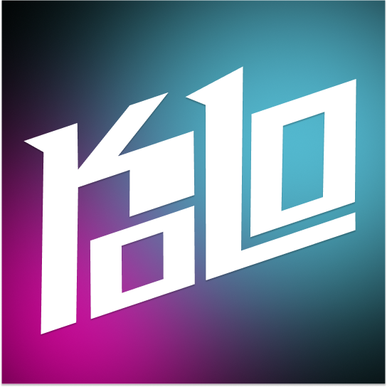
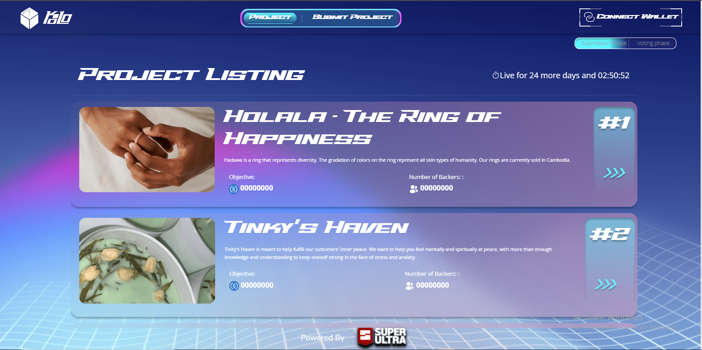

  

  

# KOLO

KOLO is a DAO Micro-funding gamefi platform using blockchain technology to redistribute game revenue to various projects. Itis a platform that provides its users have easy access to invest and get in micro-funding

## Screenshots

## Build with

- [Typescript](https://www.typescriptlang.org/)
- [React](https://reactjs.org/)

## Note

This Project is built for the Moralis & Hackathon - ANovember 2022.

The entire project is divided in 4 parts. Here are the links to all the different github repos:

## The 4 parts

- [KOLO Unity Repo](https://github.com/superultra-io/Kolo_Unity)
- [KOLO website Repo](https://github.com/superultra-io/Kolo_Website)
- [KOLO Backend Cloud Repo](https://github.com/superultra-io/kolo_backend)
- [KOLO Smart Contracts Repo](https://github.com/superultra-io/kolo_contract])

## What is micro-funding?

Micro funding is a type of funding offered to self-employed individuals and small business owners by individuals.

## Funds

Where does the money for the funds come from? The money for the loan may come from one person or may be collected from several people who will each contribute to the total amount. In the case of Kolo, the money is generated from ads and converted into USDC, and stored.
The DAO decides how the funds are used and distributed among all projects.

## The DAO

The requirement to be a member of the DAO is just to have a minimum of 1 KOL. Using the KOLO app allows users to collect points to get KOL Tokens. The more KOL Tokens a user has, the more vote power they have.

## Why Blockchain?

The investment cycle and actions are recorded on the blockchain, ensuring security and transparency.

## What kind of projects are supported?

As KOLO aims to democratize opportunities, any entrepreneurial projects such as farming or any small businesses in need of a small investment to start or to grow can apply. The list of requirements is important and communication is the key to success.

## Built With

- [![typescript]][typescript-url]
- [![react]][react-url]
- [![ethers.js]][ethers-url]
- [![prettier]][prettier-url]
- [![ESLint]][eslint-url]

## How to use

- Please make sure you have a metamask or other wallets in your phone.
- Please Connect your wallet in the first time you open the app.
- Play the game, Watch the ads, Earn the KOL so you can vote for your favorite project in the webapp!

- [KOLO WebApp](https://kolo.superultra.io/)

## Features:

- [x] Game integrated
- [x] Ads viewing
- [x] KOL token earning
- [ ] More Games
- ...

### A BIG THANKS TO MORALIS, GOOGLE CLOUD AND THEIR RESPECTIVE TEAMS !!!

### ⭐️ ...and don't forget to leave a star if you like it! ⭐️

<!-- MARKDOWN LINKS & IMAGES -->

[react]: https://img.shields.io/badge/-ReactJs-61DAFB?logo=react&logoColor=white&style=for-the-badge
[react-url]: https://reactjs.org/
[typescript]: https://img.shields.io/badge/typescript_v4.8.4-375BD2?style=for-the-badge&logo=typescript&logoColor=61DAFB
[typescript-url]: https://www.typescriptlang.org/
[prettier]: https://img.shields.io/badge/Prettier-360D3A?style=for-the-badge&logo=Prettier&logoColor=61DAFB
[prettier-url]: https://prettier.io/
[eslint]: https://img.shields.io/badge/ESLint-4B32C3?style=for-the-badge&logo=ESLint&logoColor=61DAFB
[eslint-url]: https://eslint.org/
[ethers.js]: https://img.shields.io/badge/Ethers.js-2535a0?style=for-the-badge&logo=data:image/png;base64,iVBORw0KGgoAAAANSUhEUgAAADcAAAAwCAYAAAC13uL+AAAAAXNSR0IArs4c6QAAAARnQU1BAACxjwv8YQUAAAAJcEhZcwAADsMAAA7DAcdvqGQAAALVSURBVGhD7ZjPSxdBGIf7Z7p1ky51CS928qQnu5SH9BIeAiFJEAwPVgfx5EkIBCEIgkAIBEEQBOlP2ny+MDDfl8/uvjM7U23s4SHNd2fez7y/ZvfBw8enzf/KJG6sTOLGyiSuBE+enzfPlr/OUH+vQVVxC4tnzebby+bw+K45Ovk1x9a7q+pCq4lbe30hRVkQ+ejpF7nGUKqII1pKSBvvD26qCCwubv3NTymgj+29a7neEIqKo4as0x8+3zbLa99n9Rfslla/zcRY29WXP+bWG0pRcfufbuecJT2VXQAxsT01WjI9i4kjOrGjWztX0s5in3uxcSHtcsgWRwq+uq8vmkHsHHxMjAAHYdcAIkn6rtxHOE5rL8niGMaqXmL60tHCmmodC+NFPd9GkjgagWd2kWrq+S52RQYoUg7OLY7T7RLGpjQI0jWnKcTXMw6R9UhvtZe3q7rE4azthAHmWo0BDNSZiqi3q7rE0cHsBpCTfqkggllp9/ZEzyVORa30wO3Cjgvw3Gh6xZEadmFOUtnWguhZH0DZxvSKU1eqPxm1gKo9ZRfTK07VG4KVrZec59VsVXYxf0VcTiOqIk6lJXNI2XphzdTrlG1qnrrPEjf0couwlLpVTY35qmxjesWpTuW98XdBmnmHP7cV64Mn8r3iQN3avY61Qd157olqxnkzxyVObZDTFCxEjw9EKgpLK/ptvfjFWV2BSrw183wQwL+g3g8DnjqLcYkD9c6VcopdkAXq/higLHLGj1scqPRE4NAIBjhAxgw1RTdFUO7aPJckDtjcvmcxg4bOvlRwHvHUJofO/vzOAYUDSRYHNADVnqkXvnewgXouheA88HkBqEnqjr09kc0SF0Akm7V9IsAZumFwrg1sQkOhUZEZ/IwIUpSoeOaaZZC4GDbnJHEGwcHZAAdg/w877CFESa2dSzFx/yKTuLEyiRsrk7ixMokbK5O4cXLa/Ab0j7hz1hk9uQAAAABJRU5ErkJggg==
[ethers-url]: https://docs.ethers.io/v5/
