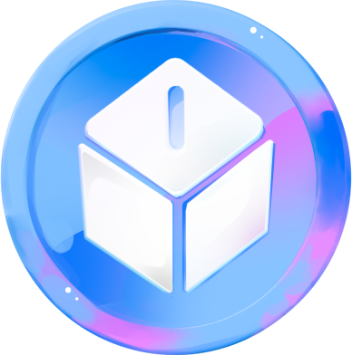

<div align="center">

<h1><strong> KOLO Web Application - Frontend </strong></h1>
<h2>Google x Moralis Hackathon - 11/2022</h2>

<br></br>


</div>

- NFT smart-contract: https://testnet.cronoscan.com/address/0x8208Bb3a2e25310BAd343fD80968F061F23a707B#code
- Marketplace smart-contract: https://testnet.cronoscan.com/address/0xd5A32E3fb8cBeacbd10E51172067A5AEf02Ef5D6#code

## Note

KOLO is a DAO Micro-funding gamefi platform using blockchain technology to redistribute game revenue to various projects. Itis a platform that provides its users have easy access to invest and get in micro-funding

The entire project is divided in 3 parts. Here are the links to all the different github repos:

- Unity Game: https://github.com/shamrockstudios/Planet-Giant_Game
- React Webapp: https://github.com/shamrockstudios/Planet-Giant_Webapp
- Backend contracts: https://github.com/shamrockstudios/Planet-Giant_Contracts

## Description

This backend cover 2 parts:

- Batch mint: node.js code to allow the NFT's images and attributes to be generated and stored on IPFS.
- Smart-contracts: NFTs and Marketplace smart-contract to mint NFTs and sell/buy them on the dedicated marketplace.

## Built With

- [![solidity]][solidity-url]
- [![hardhat]][hardhat-url]
- [![ethers.js]][ethers-url]
- [![typescript]][typescript-url]
- [![node.js]][nodejs-url]
- [![prettier]][prettier-url]
- [![ESLint]][eslint-url]

## Installation

### Make sure you have the following ready:

- [node.js](https://nodejs.org/) installed (developped on LTS v16.16.0)
- [typescript](https://www.typescriptlang.org/) installed (developped on v4.7.4)
- [yarn](https://yarnpkg.com/) installed
- [MetaMask](https://metamask.io/) (or any web3 compatible wallet) installed in your browser

### Once your config is ready, create a new repo, open your favorite code editor, and clone the repo with the following cmd:

```
git clone https://github.com/shamrockstudios/Planet-Giant_Contracts.git .
```

### Install all package dependancies by running:

```
yarn install
```

### Generate the NFT attributes & save them on IPFS:

1. Navigate in:

```
cd src
```

2. Then edit the file `image.js` to match your content, then run:

```
node image.js
```

3. Finally edit the file `metadata.js` (don't forget to edit the IPFS image path with the newly generated one), and run:

```
node matadata.js
```

### Deploy your smart-contract

Go back to the root folder by typing:

```
cd ..
```

Now you'll have to edit a few file:

- The deployment script in `scripts\deploy.ts` with your data (or even better create a .env file);
- The NFT_minter contract in `contract\NFT_minter.sol` with your own IPFS path;
- The `hardhat.config.ts` file depending on which network you want to deploy your NFT collection.
  Once you're ready, simply run:

```
yarn deploy
```

And let the magic do its thing!

<br></br>

<div align="center">

### A BIG THANKS TO MORALIS, CRONOS AND THEIR RESPECTIVE TEAMS !!!

### ⭐️ ...and don't forget to leave a star if you like it! ⭐️

</div>

<p align="right">(<a href="#top">back to top</a>)</p>

<!-- MARKDOWN LINKS & IMAGES -->

[node.js]: https://img.shields.io/badge/Node.js-339933?style=for-the-badge&logo=node.js&logoColor=ffffff
[nodejs-url]: https://soliditylang.org/
[solidity]: https://img.shields.io/badge/Solidity_v0.8.16-35495E?style=for-the-badge&logo=solidity&logoColor=4FC08D
[solidity-url]: https://soliditylang.org/
[typescript]: https://img.shields.io/badge/typescript_v4.7.4-375BD2?style=for-the-badge&logo=typescript&logoColor=61DAFB
[typescript-url]: https://www.typescriptlang.org/
[prettier]: https://img.shields.io/badge/Prettier-360D3A?style=for-the-badge&logo=Prettier&logoColor=61DAFB
[prettier-url]: https://prettier.io/
[eslint]: https://img.shields.io/badge/ESLint-4B32C3?style=for-the-badge&logo=ESLint&logoColor=61DAFB
[eslint-url]: https://eslint.org/
[hardhat]: https://img.shields.io/badge/Hardhat-35495E?style=for-the-badge&logo=data:image/png;base64,iVBORw0KGgoAAAANSUhEUgAAADoAAAA1CAYAAAAQ7fj9AAAAAXNSR0IArs4c6QAAAARnQU1BAACxjwv8YQUAAAAJcEhZcwAADsMAAA7DAcdvqGQAAAWUSURBVGhD7ZlrTFtlGIBPWwpt7VoRERghRCM44x+zwRKNmUbUwebmLZvXKWjihSnxD7DE/VgCS3Qui9nUqD82My8bsokzjggbl82BBgcMGDCGQwKMoQiFcR8br9/7wam9vOfSnm5xXX88Sdtze5++3/d+7zlHiF2cCDcCIdFgIyQabIREA8VTT8bA5k23wIdbb+bUlJs44vec7ChIS4sjjw0kV0UUA0cZGBV8ovSgBZKXJJDn1MpVEa094rukyBe7bOQ5tRJQ0RUPLobqUhOM9OpJCTXgsTicA53ZgIjiUG2vM8KVYQHmRmgBX0FhnMOBEtYkGhefCGUlZrj8j8C5MkQHrYWe1jB4mhU06vq+4LfoKxuiYbxXB7N/CU7mWEapYAPB/i+tmrLrl+i7G6Ng5oIAl1yYHaAD9KT9pJn8XQ0tv4X7Leuz6J5PF8HMecGLy4N0cJ5kvhQDX+9OJrepAWVTl8eTscnhk2jOW1Ew3SuQzDnowFwp3muA1JQ4WP9cOgx0XtvMqhZdnRELkz0CTBFM99EBuTLBhvcdt5u56Oo1a6BgSwq5n1pOnQgn45RClWh8QiI4OnUw2S2Q4BylgnFlc64RLBaLUxRp/jWK3FcVbBmrZd0XFS+FKtHyA2aY+JNlRQJcWshgFuhq0oHNZvYSzXo1jdxfLXjd11+7lYzZE0XRR1gzMHGOCcmg1CSsWhnBJT1FES2FCUWHuvRk3J4oirbVGGH8D0GSSZZRKgiRH741OCUpUSxMY/1G8lglsEHBabNzm3J/LCuamhoPY50CjJ2VZopVXCoIZPpvAZLuNMmKIju23UserwS2nLi0DXYqZ1VW9NBXFrjYIcgy008HgVQf1oPdPj83RZYToplZaX5nVaz8z6+/jXQQkRUdbtPBaLsgyyzLGhWASHeLDjIeo+foumfTNc1RBNdwrPwNVfLLjaTo46tiYaSN3UUoINfIX2BDu6Nexz+XfGPgw1gUzc+739k0aFlmcOpMdAngOKsjPUQkRffssoLjNDuBAkoV9503jPAeW0OxYUA+KIiE2opYvg1FN+Xdp0kUm5VxVvmRZSnSraGk6OljYaSYG630xV2ZYnc1dy8x8Wwe2mdw/o5DFjP7+cf3uO3vK1gjeMFk7NhqJ10QSdH+ej04WpiMDDhHqYt70viLDqzW+aL0wjozbxRQ8u2NK/wuQiLTrOqKhbGqRLpTkhQdZN3McLMgC85R6uIU2wvDuOhdyRZnMTrXZCP39QUcuhfPzOOXKGZsuEmeERVDVwTn8qMPRzhFtVZbEay6o+wPR5qrjKQLIilKiXniS0YRrMIpS2/iFZfa7g+4vI2weoGcb5BuHCRFh06xPlIBLEjUxeX4sciq6V7UE+yMHGwaIX2srlAuiLRoI5NBmBAOC2zesQPBE+PzIWyoA/XETws4dMUR1nfSR9HMDdH8BLzr+R/IqOHSABu6LQbJ1xteoviYgjrR9QT1tN9LlDoQnwc1HguH5uNGqDhggqrvTdBRp23984fG6nA4Wmzi4GepGPCViKcXKdrxuxFO/BQBx0si4Ey1watRwImP62jldxGaXj+oBYXqDxv/qxse4LbKoggoKzJDX6tBnWh5kYmvj24slG/e9nkIt1cYeLapAANB5UETKSfHJ+8vcnNCvESTkxMgOysKjuwzORdifqfiIu0mvJDdhlIjVLGgcEjhv0oFrQbMHh+i7A9vO2ogRSi6a/Swe7sVXnwm2s1HxEvUkycyYiA/JxJ2Ftq4fE+d3lt4QZaXeVxjiUACSUtZGPy81wQFuXZ48+UoeOgB5RfJiqJSLFsaD2vTYziF+XYozLNDAaP4MwsPQgoxSDk+2mLjEkhudiSsXcmuw0hKusbvXq5HQqLBRkg02AiJBhsh0WAjJBps3CCiifAv+kBDzN+k+08AAAAASUVORK5CYII=
[hardhat-url]: https://hardhat.org/
[ethers.js]: https://img.shields.io/badge/Ethers.js-2535a0?style=for-the-badge&logo=data:image/png;base64,iVBORw0KGgoAAAANSUhEUgAAADcAAAAwCAYAAAC13uL+AAAAAXNSR0IArs4c6QAAAARnQU1BAACxjwv8YQUAAAAJcEhZcwAADsMAAA7DAcdvqGQAAALVSURBVGhD7ZjPSxdBGIf7Z7p1ky51CS928qQnu5SH9BIeAiFJEAwPVgfx5EkIBCEIgkAIBEEQBOlP2ny+MDDfl8/uvjM7U23s4SHNd2fez7y/ZvfBw8enzf/KJG6sTOLGyiSuBE+enzfPlr/OUH+vQVVxC4tnzebby+bw+K45Ovk1x9a7q+pCq4lbe30hRVkQ+ejpF7nGUKqII1pKSBvvD26qCCwubv3NTymgj+29a7neEIqKo4as0x8+3zbLa99n9Rfslla/zcRY29WXP+bWG0pRcfufbuecJT2VXQAxsT01WjI9i4kjOrGjWztX0s5in3uxcSHtcsgWRwq+uq8vmkHsHHxMjAAHYdcAIkn6rtxHOE5rL8niGMaqXmL60tHCmmodC+NFPd9GkjgagWd2kWrq+S52RQYoUg7OLY7T7RLGpjQI0jWnKcTXMw6R9UhvtZe3q7rE4azthAHmWo0BDNSZiqi3q7rE0cHsBpCTfqkggllp9/ZEzyVORa30wO3Cjgvw3Gh6xZEadmFOUtnWguhZH0DZxvSKU1eqPxm1gKo9ZRfTK07VG4KVrZec59VsVXYxf0VcTiOqIk6lJXNI2XphzdTrlG1qnrrPEjf0couwlLpVTY35qmxjesWpTuW98XdBmnmHP7cV64Mn8r3iQN3avY61Qd157olqxnkzxyVObZDTFCxEjw9EKgpLK/ptvfjFWV2BSrw183wQwL+g3g8DnjqLcYkD9c6VcopdkAXq/higLHLGj1scqPRE4NAIBjhAxgw1RTdFUO7aPJckDtjcvmcxg4bOvlRwHvHUJofO/vzOAYUDSRYHNADVnqkXvnewgXouheA88HkBqEnqjr09kc0SF0Akm7V9IsAZumFwrg1sQkOhUZEZ/IwIUpSoeOaaZZC4GDbnJHEGwcHZAAdg/w877CFESa2dSzFx/yKTuLEyiRsrk7ixMokbK5O4cXLa/Ab0j7hz1hk9uQAAAABJRU5ErkJggg==
[ethers-url]: https://docs.ethers.io/v5/
